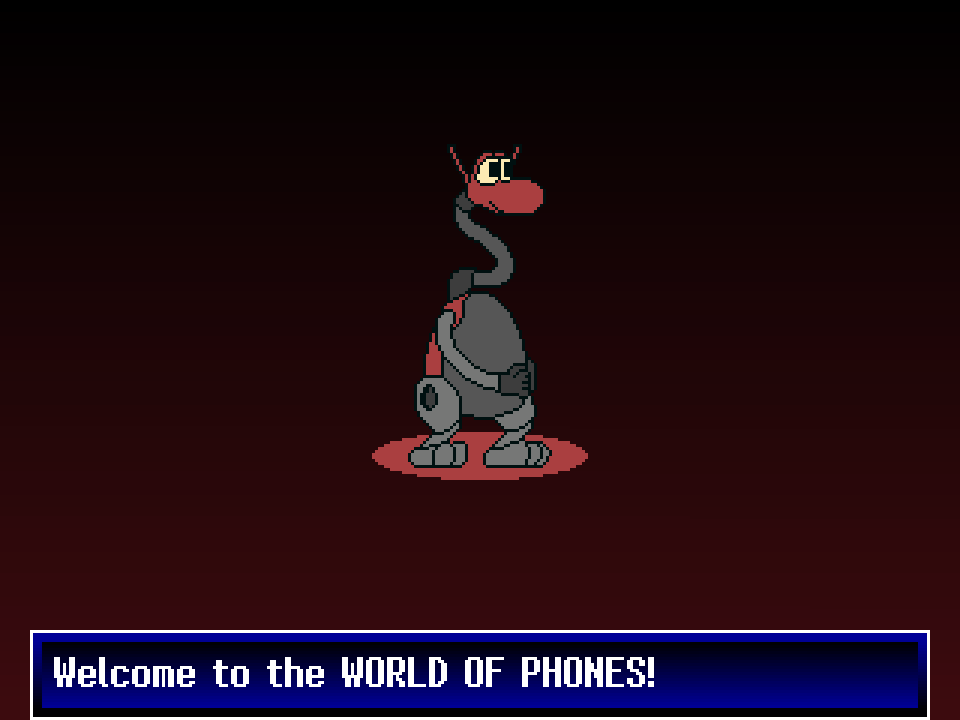
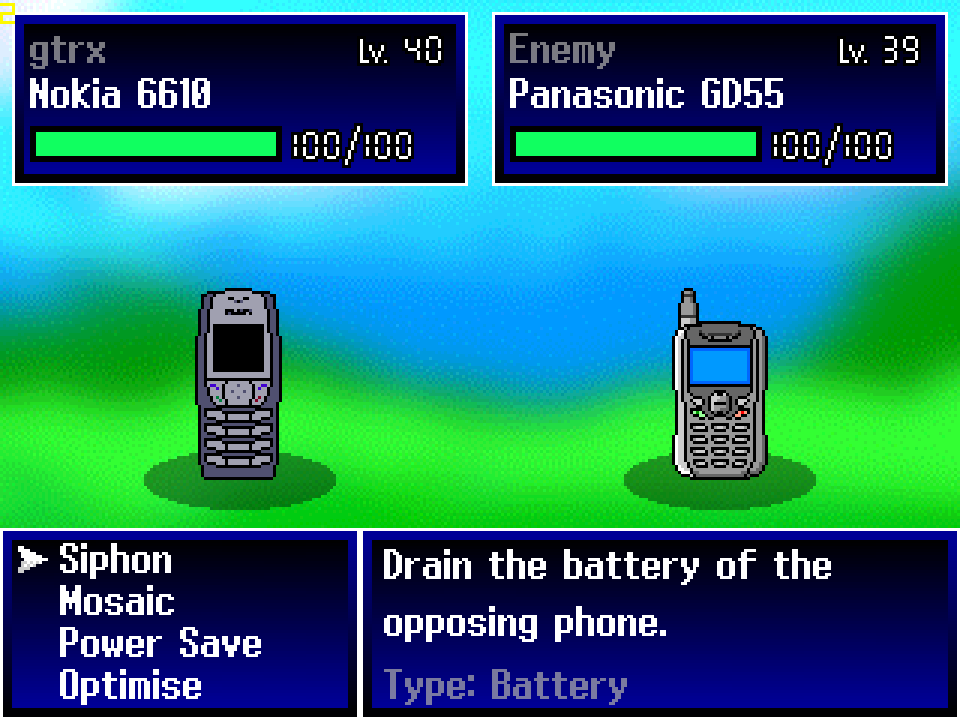
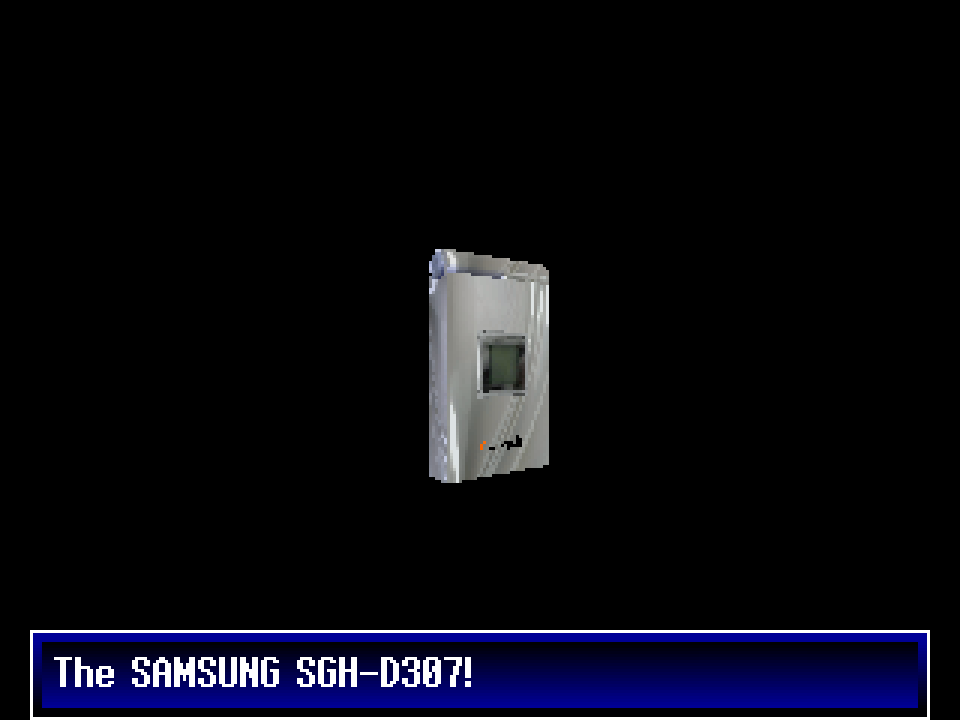

# ROMphonix RPG
A phone collecting RPG! (in early development)

* [Discord](https://discord.gg/qQ2yCmynCK)
* [Development Wiki](https://github.com/gtrxAC/romphonix-rpg/wiki)
* [Project wall](https://github.com/users/gtrxAC/projects/1)

    
    

    
    

## Download
* [GitHub (need account)](https://github.com/gtrxAC/romphonix-rpg/releases)
* [nightly.link (no account)](https://nightly.link/gtrxAC/romphonix-rpg/workflows/main/main)

## Building
1. If you're on Windows, download [w64devkit](https://github.com/skeeto/w64devkit/releases). Make sure you get a release zip, not the source code. Extract the archive somewhere and run `w64devkit.exe`. On Linux, just open a terminal.
2. Follow the below instructions for the platform you want to build for.

### Desktop
2. Run `./setup.sh` to set up the project.
3. Run `./build.sh` to compile the project.

### Web
1. Run `TARGET=Web ./setup.sh` to set up the project. You will need about 1 GB of free space.
2. Run `TARGET=Web ./build.sh` to compile the project.

### Compiling for Windows from Linux
1. Install `mingw-w64` using your package manager.
2. Run `TARGET=Windows_NT ./setup.sh` to set up the project.
3. Run `TARGET=Windows_NT ./build.sh` to compile the project.
